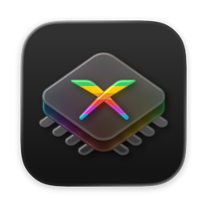

    

<h1 align="center">XeniOS - Xbox 360 Emulator</h1>

XeniOS is an experimental Apple-focused fork of Xenia, currently based on
[Xenia Edge](https://github.com/has207/xenia-edge). It exists as a fast-moving
place to develop, test, and ship iOS and macOS work while also carrying
platform changes that benefit ARM64 Windows, Linux, and Android. Relevant
improvements are intended to flow back upstream over time.

  <a href="https://xenios.jp">Website</a> ◦
  <a href="https://github.com/xenios-jp/XeniOS/releases">Releases</a> ◦
  <a href="https://xenios.jp/docs">Docs</a> ◦
  <a href="https://xenios.jp/faq">FAQ</a> ◦
  <a href="https://xenios.jp/compatibility">Compatibility</a> ◦
  <a href="https://discord.gg/QwcTtNKTGf">Discord</a> ◦
  <a href="https://github.com/xenios-jp/XeniOS/issues">Issues</a>

## Current Focus

- iOS
- macOS (Apple Silicon)
- macOS (Intel)

Current published releases focus on iOS and macOS.
For Windows or Linux builds, use [Xenia Edge](https://github.com/has207/xenia-edge) or [Xenia Canary](https://github.com/xenia-canary/xenia-canary).

## Why This Fork Exists

Xenia development is relatively thinly staffed right now, and upstream is not
set up for fast iteration on Apple-specific packaging, documentation, release
flow, and user experience. XeniOS exists so that work can move faster in a
repository where the full product experience can be shaped directly, from the
app itself to releases, docs, compatibility reporting, and the public website
at [xenios.jp](https://xenios.jp).

The goal is not to keep good work siloed here forever. The goal is to iterate
quickly, build a more polished user-facing experience for Apple platforms, and
then contribute the useful technical improvements back upstream into the
broader Xenia community, especially
[Xenia Canary](https://github.com/xenia-canary/xenia-canary).

## Downloads

Download XeniOS from

- [Latest GitHub release](https://github.com/xenios-jp/XeniOS/releases/latest)

   

## Quickstart

Start with the public docs at [xenios.jp/docs](https://xenios.jp/docs).

## FAQ

See the public FAQ at [xenios.jp/faq](https://xenios.jp/faq).

## Game Compatibility

Browse currently tracked games on
[xenios.jp/compatibility](https://xenios.jp/compatibility).

To file a compatibility report, use the
[GitHub compatibility tracker](https://github.com/xenios-jp/game-compatibility/issues/new/choose).

## Building

See [building.md](https://github.com/xenios-jp/XeniOS/blob/xenios/docs/building.md) for setup and information about the
`xb` script. When writing code, check the [style guide](https://github.com/xenios-jp/XeniOS/blob/xenios/docs/style_guide.md)
and be sure to run clang-format!

## Contributors Wanted!

Have some spare time, know advanced C++, and want to write an emulator?
Contribute! There's a ton of work that needs to be done, a lot of which
is wide open greenfield fun.

**For general rules and guidelines please see [CONTRIBUTING.md](https://github.com/xenios-jp/XeniOS/blob/xenios/.github/CONTRIBUTING.md).**

Fixes and optimizations are always welcome, especially around Apple platform
performance, UI polish, compatibility coverage, packaging, and tooling.

Start with the
[XeniOS issue tracker](https://github.com/xenios-jp/XeniOS/issues),
join the [XeniOS Discord](https://discord.gg/QwcTtNKTGf), check
[CONTRIBUTING.md](https://github.com/xenios-jp/XeniOS/blob/xenios/.github/CONTRIBUTING.md), and coordinate before starting
larger work.

## Disclaimer

The goal of this project is to experiment, research, and educate on the topic
of emulation of modern devices and operating systems. **It is not for enabling
illegal activity**. All information is obtained via reverse engineering of
legally purchased devices and games and information made public on the internet
(you'd be surprised what's indexed on Google...).

